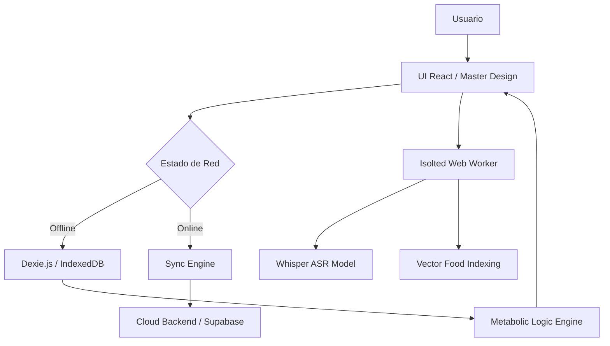

# 🩸 BloodCare AI: Ecosistema Metabólico Soberano

> **Proyecto Oficial ITCM - Hackatec Etapa Local 2026**
> "Transformando el monitoreo metabólico mediante Inteligencia Artificial Soberana y Resiliencia en el Borde."

---

## 🚀 Visión Estratégica
BloodCare es una **infraestructura de salud soberana** de grado industrial. En un entorno donde la privacidad de los datos clínicos es crítica, BloodCare desplaza la inteligencia del servidor central al **dispositivo del usuario (Edge Computing)**. Nuestra arquitectura garantiza privacidad absoluta, eliminando la dependencia total de la nube y priorizando la autonomía del paciente.

---

## 🛠️ Arquitectura Técnica Detallada (Sovereign Stack)

### 🧠 Inteligencia Artificial Local (On-Device Processing)
El núcleo de inteligencia opera de forma autónoma mediante un **Web Worker** dedicado, garantizando que la UI nunca se bloquee durante el procesamiento:
- **ASR Engine (Whisper):** Integración de `@xenova/transformers` ejecutando modelos de reconocimiento de voz de alto rendimiento directamente en el navegador.
- **Semantic Vector Search:** Motor de búsqueda local que transforma el diccionario de alimentos en tensores. Utiliza similitud de coseno para encontrar el alimento exacto incluso con descripciones ambiguas o lenguaje natural.
- **Extracción de Cantidades:** Lógica integrada para detectar proporciones (ej: "un par de", "medio", "triple") y ajustar automáticamente el impacto glucémico calculado.

### 💾 Persistencia Resiliente (IndexedDB Architecture)
Utilizamos `Dexie.js` para gestionar una base de datos local robusta con el siguiente esquema:
- **Table `glucose`:** Registro histórico de mediciones mg/dL con marcas de tiempo de alta precisión y estado de sincronización.
- **Table `meals`:** Almacenamiento de ingesta nutricional, vinculando alimentos del diccionario con cálculos de carbohidratos en tiempo real.
- **Table `settings`:** Almacén persistente de perfiles de usuario y umbrales metabólicos (Target Ranges).

### 🔄 Motor de Sincronización (Reconciliation Logic)
Un sistema de estado sólido gestiona la coherencia de datos entre el dispositivo y la nube:
- **Sync State Tracking:** Cada registro posee un flag `synced`. El sistema detecta automáticamente la recuperación de red.
- **Background Push:** Reintento automático de subida a la API **FastAPI / Supabase** sin intervención del usuario.
- **Data Integrity:** Reconciliación post-sincronización para garantizar que el historial local siempre refleje la verdad del servidor una vez recuperada la conexión.

---

## 🎨 Sistema de Diseño Maestro (High-Fidelity UI)

### 💎 UX Cinematográfica
- **Motion Engine:** Uso extensivo de `motion/react` (Framer Motion) para transiciones de pantalla `mode="wait"`, micro-interacciones en botones y feedbacks visuales suaves.
- **Glassmorphism (iOS Blur):** Efectos de desenfoque nativos y capas translúcidas que imitan la estética premium de los sistemas operativos modernos.

### 📱 Responsividad Adaptativa
- **Universal Layout:** Contenedor maestro con restricciones inteligentes de ancho (`max-w-md`) que aseguran una experiencia perfecta tanto en dispositivos móviles como en navegadores de escritorio.
- **Dynamic Theming:** Paleta de colores curada basada en variables CSS para una consistencia visual absoluta en toda la plataforma.

---

## 🛡️ Seguridad y Sanitización (Client-Side Hardening)

- **Input Sanitization:** Procesamiento de texto y audio con filtros de seguridad locales antes de cualquier operación de base de datos.
- **Privacy First:** El audio se procesa en memoria volátil y se destruye tras la transcripción. Nada de voz viaja a través de la red.
- **Isolation:** El Web Worker opera en un hilo aislado, protegiendo la ejecución de modelos de IA de ataques de scripting externos.

---

## 🏗️ Diagrama de Flujo de Datos



---

## 📈 Especificaciones Técnicas
- **Frontend:** React + Vite + Tailwind CSS v4.
- **IA Engine:** @xenova/transformers.
- **Persistencia:** Dexie (IndexedDB).
- **Backend:** FastAPI + PostgreSQL (Supabase).
- **Latencia ASR:** < 1.5s (Promedio en dispositivos gama media).
- **Consumo RAM:** Optimizado para dispositivos móviles (< 150MB).

---

## 🎓 Identidad Institucional
BloodCare es el resultado de la excelencia académica y técnica del **Instituto Tecnológico de Ciudad Madero**. Representa una solución de soberanía tecnológica diseñada para democratizar el acceso a la salud inteligente, eliminando la barrera de la conectividad y protegiendo el activo más valioso del paciente: su privacidad.

---

## 🛠️ Instalación para Desarrolladores

```bash
# Clonar el repositorio
git clone https://github.com/jjho05/BloodCare.git

# Entrar al frontend
cd BloodCare/frontend

# Instalar dependencias industriales
npm install

# Iniciar motor de desarrollo (Puerto 3005)
npm run dev
```
