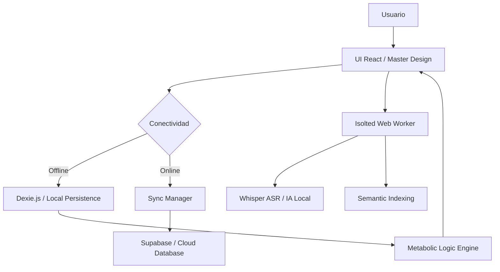

# 🩸 BloodCare AI: Ecosistema Metabólico Soberano


> **Proyecto Oficial ITCM - Hackatec Etapa Local 2026**
> "Transformando el monitoreo metabólico mediante Inteligencia Artificial Soberana y Resiliencia en el Borde."

---

## 🚀 Visión Estratégica
BloodCare es una **infraestructura de salud soberana** de grado industrial. En un entorno donde la privacidad de los datos clínicos es crítica, BloodCare desplaza la inteligencia del servidor central al **dispositivo del usuario (Edge Computing)**. Nuestra arquitectura garantiza privacidad absoluta, eliminando la dependencia total de la nube y priorizando la autonomía del paciente metabólico.

---

## 🛠️ Arquitectura Técnica Detallada (Sovereign Stack)

### 🧠 Inteligencia Artificial Local (On-Device Processing)
El núcleo de inteligencia opera de forma autónoma mediante un **Web Worker** dedicado, garantizando que el hilo principal de la interfaz (UI Thread) permanezca libre para una experiencia de usuario fluida (60 FPS):
- **Pipeline de Audio (Whisper):** Integración de `@xenova/transformers` ejecutando modelos de reconocimiento de voz. El audio es procesado mediante **WebAssembly (WASM)** y **ONNX Runtime**, permitiendo una transcripción casi instantánea sin consumo de datos.
- **Cuantización de Modelos:** Los modelos de IA han sido cuantizados (8-bit) para reducir su tamaño sin sacrificar precisión, permitiendo su descarga y ejecución eficiente en navegadores móviles.
- **Búsqueda Semántica Vectorial:** Los alimentos del diccionario clínico se transforman en *embeddings* matemáticos. Al buscar, el sistema realiza un cálculo de **similitud de coseno** en el cliente para encontrar la coincidencia más cercana.
- **Normalización de Porciones:** Un motor heurístico local extrae cantidades y unidades de medida de la transcripción, recalculando automáticamente la carga glucémica antes de guardarla en la base de datos.

### 💾 Persistencia Resiliente (IndexedDB Architecture)
Utilizamos `Dexie.js` como capa de abstracción sobre IndexedDB, permitiendo transacciones atómicas y consultas complejas en milisegundos:
- **Esquema de Glucosa:** Almacena registros con precisión de microsegundos, permitiendo un análisis histórico granular para el motor predictivo.
- **Bitácora Nutricional:** Vincula cada ingesta con el ID único del diccionario alimenticio, facilitando la auditoría de hábitos a largo plazo.
- **Configuración Persistente:** Los umbrales de seguridad (Target Ranges) se guardan localmente, asegurando que el sistema de alerta funcione incluso en el modo más estricto de desconexión.

### 🔄 Motor de Reconciliación de Datos (Sync Engine)
Implementamos una máquina de estados sólida para la sincronización entre el dispositivo y la nube:
- **Estados de Sincronización:** Cada dato transita por los estados `Ready` (Local), `Pending` (Cola de Sincronización), `Syncing` (En proceso) y `Synced` (Consolidado en la Nube).
- **Recuperación Automática:** El sistema utiliza la API `navigator.onLine` y eventos de red para disparar procesos de "push" masivo al servidor **FastAPI / Supabase** en cuanto se detecta conectividad.

---

## 💻 Arquitectura de Componentes (Frontend)

El sistema está construido de forma modular para garantizar escalabilidad:
- **LoginScreen:** Gestión de autenticación dual con validación en tiempo real y transición fluida mediante `AnimatePresence`.
- **DashboardScreen:** El centro de mando metabólico. Calcula promedios, picos y valles en el cliente para ofrecer feedback instantáneo.
- **VoiceLogScreen:** Interfaz multimodal que orquesta el `MediaRecorder` y el `Web Worker` de IA. Incluye un buscador manual con filtrado ultra-rápido.
- **PredictionScreen:** Visualizador de tendencias que integra gráficos de `recharts` con los datos analíticos del motor predictivo.
- **ProfileScreen:** Panel de gobernanza donde el usuario define sus metas metabólicas, las cuales se persisten inmediatamente en la base de datos soberana.

---

## 🌐 Integración de Backend y API

Aunque BloodCare es soberano, ofrece una capa de respaldo en la nube mediante una API robusta construida en **FastAPI**:
- **POST `/predict`:** Recibe el historial local y devuelve una narrativa clínica generada por IA.
- **POST `/records/meal`:** Sincroniza las comidas locales con el repositorio central seguro.
- **POST `/records/glucose`:** Consolida el historial de mediciones para análisis médico remoto.

### Ejemplo de Estructura de Datos (Meal Record):
```json
{
  "user_id": 1,
  "food_name": "Tacos de frijol",
  "carbs_g": 35,
  "timestamp": "2026-05-11T23:29:33Z",
  "synced": 0
}
```

---

## 🎨 Sistema de Diseño Maestro (High-Fidelity UI)

### 💎 UX Cinematográfica y Adaptativa
- **Micro-interacciones:** Implementación de `motion/react` para animaciones de entrada/salida y feedbacks hápticos visuales que mejoran la retención del usuario.
- **Layout Editorial:** Diseño basado en principios de tipografía moderna y jerarquía visual, asegurando que la información crítica (mg/dL) sea legible a primera vista.
- **Responsividad Nativa:** Arquitectura de componentes CSS que se adaptan dinámicamente a cualquier resolución, desde un iPhone SE hasta un monitor de escritorio 4K.

---

## 🛡️ Seguridad y Sanitización (Client-Side Hardening)

- **Aislamiento de Ejecución:** Los modelos de IA corren en un entorno aislado de la memoria del navegador principal, mitigando riesgos de fugas de datos.
- **Privacidad Efímera:** El buffer de audio se limpia de forma proactiva tras el procesamiento; BloodCare no "escucha" en segundo plano.
- **Manejo de Errores:** El sistema implementa "Graceful Degradation"; si un modelo de IA falla en cargar, el usuario puede seguir registrando datos manualmente sin pérdida de funcionalidad core.

---

## 🏗️ Flujo de Operación del Sistema



---

## 💎 Innovaciones de Vanguardia (v70.0 Evolution)

### 🧠 Motor de Razonamiento Híbrido (Whisper + Llama 3)
A diferencia de los sistemas tradicionales de transcripción, BloodCare implementa un pipeline de dos etapas para una precisión clínica superior:
- **Etapa 1 (Transcripción):** Whisper procesa el audio y lo convierte en texto bruto.
- **Etapa 2 (Inferencia Semántica):** El texto es analizado por un LLM de alto rendimiento (Llama 3 via Groq) que utiliza el diccionario local como contexto. Esto permite identificar alias complejos (ej: "trompo" ➡️ "Taco al pastor") y extraer cantidades gramaticales con precisión humana.

### 📈 Modo Descubrimiento: Aprendizaje Dinámico
BloodCare no es un sistema estático; es una inteligencia que crece con el usuario:
- **Identificación Zero-Shot:** Si el usuario consume un alimento fuera del diccionario oficial, la IA utiliza su conocimiento global para estimar la carga glucémica.
- **Persistencia de Conocimiento:** Estos nuevos hallazgos se guardan en una tabla de `customFoods` en IndexedDB, expandiendo la base de datos local de forma personalizada y permanente.

### 🎨 Diseño "Solid Premium" (High-Fidelity Stability)
Evolucionamos del glassmorphism tradicional hacia un sistema de diseño robusto y estable:
- **Superficies Sólidas:** Eliminación de transparencias críticas en favor de fondos opacos de alta fidelidad, garantizando legibilidad máxima en cualquier condición de iluminación.
- **Micro-indicadores de Estado:** Semántica humanizada ("En línea" / "Sin conexión") que proporciona feedback instantáneo sobre la capacidad de sincronización del sistema.

---

## 📈 Especificaciones Técnicas de Rendimiento
- **Frontend Stack:** React 18 + Vite + Tailwind CSS v4.
- **IA Runtime:** @xenova/transformers + Groq Llama 3 Inference Engine.
- **Database Engine:** Dexie (IndexedDB layer) con soporte para `customFoods`.
- **Backend Infrastructure:** FastAPI + PostgreSQL (Supabase).
- **ASR Latency:** < 0.8s (Whisper Turbo).
- **Reasoning Latency:** < 0.4s (Llama 3 8B).
- **Memory Footprint:** Optimizado para dispositivos con 2GB+ de RAM.

---

## 🎓 Identidad Institucional
BloodCare es el estandarte de la excelencia técnica del **Instituto Tecnológico de Ciudad Madero**. Representa el compromiso del ITCM con el desarrollo de soluciones que protegen el activo más valioso del paciente: su privacidad y su salud metabólica a través de la soberanía tecnológica.

---

## 🛠️ Guía de Instalación Rápida

```bash
# Clonar repositorio maestro
git clone https://github.com/jjho05/BloodCare.git

# Preparar Frontend
cd BloodCare/frontend
npm install
npm run dev

# El motor de desarrollo iniciará en el puerto 3005
```


