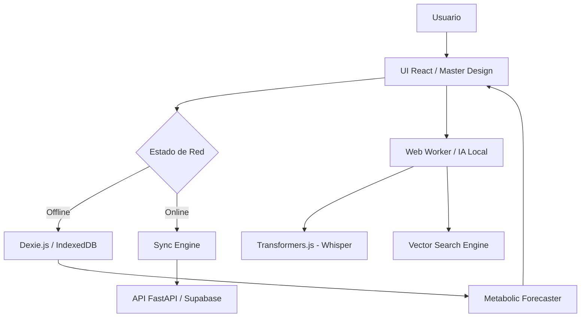

# 🩸 BloodCare AI: Ecosistema Metabólico Soberano

> **Proyecto Oficial ITCM - Hackatec Etapa Local 2026**
> "Transformando el monitoreo metabólico mediante Inteligencia Artificial Soberana y Resiliencia en el Borde."

---

## 🚀 Visión Estratégica
BloodCare no es solo una PWA de monitoreo; es una **infraestructura de salud soberana**. En un mundo donde la privacidad de los datos clínicos es vulnerable, BloodCare desplaza la inteligencia del servidor central al **dispositivo del usuario**. Nuestra filosofía es "Privacidad por Diseño, Potencia por Arquitectura".

---

## 🛠️ Stack Tecnológico (Sovereign Edge Stack)

### 🧠 Inteligencia Artificial Local (On-Device AI)
- **ASR Engine:** Integración de `Transformers.js` ejecutando modelos de **Whisper** en un Web Worker. Transcripción de voz a texto sin enviar audio a la nube.
- **Semantic Search:** Motor de búsqueda vectorial local que utiliza *embeddings* para encontrar alimentos en el diccionario clínico, permitiendo lenguaje natural (ej: "Me comí un par de tacos" -> Detecta cantidad y alimento).
- **Metabolic Forecasting:** Algoritmo predictivo que proyecta niveles de glucosa a 6 horas basado en el historial persistido localmente.

### 💾 Resiliencia y Persistencia (Offline-First)
- **Engine:** `Dexie.js` (IndexedDB) para almacenamiento de grado industrial.
- **Data Safety:** Persistencia total de registros de glucosa, comidas y perfiles de usuario.
- **Sync Motor:** Algoritmo de sincronización en segundo plano que detecta recuperación de red y consolida datos locales con el backend **FastAPI / Supabase**.

### 🎨 Interfaz de Alta Fidelidad (Master Design)
- **Framework:** React + Vite + Tailwind CSS v4.
- **Aesthetics:** Diseño basado en el **Master Design de GlucoGen**, optimizado para responsividad extrema y fluidez cinemática con `motion/react`.
- **Identity:** Branding institucional del **ITCM** (Instituto Tecnológico de Ciudad Madero).

---

## 🌟 Funcionalidades de Grado Industrial

1.  **Dashboard Editorial:** Visualización dinámica de métricas vitales (Promedio, Máximos, Mínimos) con codificación de color semántica basada en umbrales metabólicos personalizados.
2.  **Bitácora Multimodal:** Registro de alimentos mediante voz o búsqueda inteligente con extracción automática de porciones.
3.  **Perfil Soberano:** Configuración de metas metabólicas (Target Range) que gobiernan la lógica de alerta de toda la aplicación.
4.  **Autenticación Híbrida:** Sistema dual de acceso mediante Correo/Password y Google OAuth oficial.
5.  **PWA Pro:** Instalable en iOS/Android con caché inteligente de modelos de IA (~50MB) para funcionamiento 100% autónomo.

---

## 🏗️ Arquitectura del Sistema



---

## 🎓 Impacto Institucional (Hackatec ITCM)
BloodCare representa el compromiso del **Instituto Tecnológico de Ciudad Madero** con la innovación disruptiva. Es una solución diseñada para democratizar el acceso a herramientas de salud avanzada, eliminando la barrera de la conectividad y priorizando la soberanía tecnológica del paciente mexicano.

---

## 🛠️ Instalación para Desarrolladores

```bash
# Clonar el repositorio
git clone https://github.com/jjho05/BloodCare.git

# Entrar al frontend
cd BloodCare/frontend

# Instalar dependencias industriales
npm install

# Iniciar motor de desarrollo (Puerto 3005)
npm run dev
```

---
**Desarrollado con ❤️ para el ITCM por Antigravity Architect.**
*"La tecnología es soberana o no es tecnología."*
